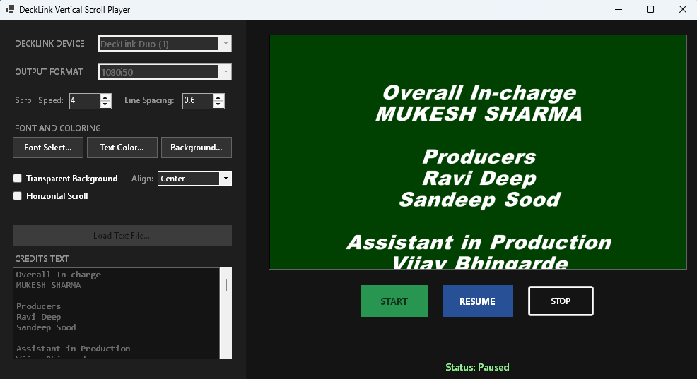

# DeckLink Vertical Scroll Player



A premium, high-performance Windows Forms application written in VB.NET on **.NET 10.0-windows**, designed for continuous vertical and horizontal scrolling credits and text broadcasting via **Blackmagic DeckLink** (SDI/HDMI) output cards.

It implements a modern dark-mode control dashboard, high-performance dual-threaded canvas rendering, GDI+ sub-pixel font anti-aliasing, and native DeckLink SDK COM interop.

---

## Key Features

- **Native DeckLink Broadcasting**: Outputs video frames directly to Blackmagic cards using low-latency YUV color conversion (`CDeckLinkVideoConversionClass`) and synchronized frame delivery (`DisplayVideoFrameSync`).
- **High-Performance Multithreading**: Decouples the rendering loop from the Windows Forms UI thread, ensuring consistent frame-rates (e.g., 50i / 60p / 50p) with no jitter or GUI freezing.
- **Pause & Resume Controls**: Allows operators to freeze the scrolling text midway. During a pause, the rendering engine continues actively broadcasting the frozen frame to keep the SDI/HDMI connection alive and stable (avoiding receiver dropouts).
- **Transparent Background Color**: Includes a "Transparent Background" toggle option. When selected, the background canvas is cleared with alpha transparency (Alpha = 0), allowing the text overlay to be downstream keyed cleanly.
- **Horizontal Ticker Mode**: Includes a "Horizontal Scroll" toggle that flattens text and scrolls it continuously from right to left across a generated lower-third background strip.
- **Auto-Startup & Restores Settings**: Automatically saves/loads the user's settings (font, colors, speed, selected device, video mode, and scroll text) to `settings.json`. Initiates streaming automatically on startup.
- **Robust MSBuild Lifecycle Integration**: Includes custom MSBuild build targets inside the project file:
  - **Pre-build target (`KillRunningPlayer`)**: Terminates active instances of the player to free locked assemblies (avoiding file access compilation errors).
  - **Post-build target (`CreateTimestampedExecutable`)**: Cleans old files, renames the output to a timestamped file format (e.g. `DeckLinkVerticalScrollPlayer_DDMMYY_HHMMSS.exe`), and launches it in a detached CMD process.

---

## Directory Structure

```text
DeckLinkVerticalScrollPlayer/
├── .gitignore
├── README.md
├── DeckLinkVerticalScrollPlayer.vbproj (MSBuild project targets)
├── Form1.vb (Main GUI & DeckLink renderer logic)
├── Form1.Designer.vb (Dark Mode Form Layout)
├── Program.vb (Application entrypoint)
├── DeckLinkAPI.dll (Desktop Video SDK interop library)
├── build_deploy_run.bat (Batch launcher)
└── build_deploy_run.ps1 (PowerShell build script)
```

---

## Getting Started

### Prerequisites
- **OS**: Windows 10 / 11 (64-bit)
- **SDK**: [.NET 10.0 SDK](https://dotnet.microsoft.com/download/dotnet/10.0)
- **Drivers**: Blackmagic Desktop Video drivers installed.
- **Hardware**: Blackmagic DeckLink PCIe card or UltraStudio USB/Thunderbolt device.

### Compiling and Running
1. Double-click or run `build_deploy_run.bat` from CMD:
   ```cmd
   build_deploy_run.bat
   ```
This will compile the project, clean up any previous builds, copy/rename the fresh build with a timestamp, and start the playback automatically!

---

## Control Guide

* **Start Output**: Initiates connection to the selected DeckLink device and begins vertical scrolling playback.
* **Pause / Resume**: Freezes the scrolling progress instantly while maintaining an active DeckLink video signal.
* **Stop Output**: Halts the transmission and closes the DeckLink video channel.
* **Horizontal Scroll**: Toggles the playback into a horizontal news-ticker loop with an automatic lower-third solid background strip.
* **Transparent Background**: Clears the canvas with alpha transparency for downstream keyers.
* **Font / Text Settings**: Customize fonts, sizing, text color, background color, and scrolling speeds (pixels-per-frame) in real time.

---

## License
Created for broadcast automation and digital graphics distribution.
